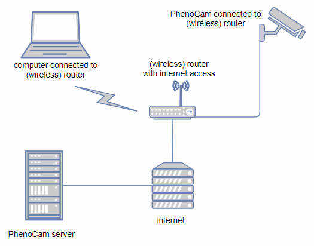

## Phenocam Installation Tool (PIT) - Phenocam安装工具

### 1. 安装

**硬件要求**



- **可以访问Internet**的网络（无线也行）
- Phenocam相机
- 计算机

**软件要求**

- PIT
- StarDot Tools

**安装注意**

- 相机的最佳朝向是**北方**，尽量减少镜头眩光和阴影
- 镜头内必须**包括天空**，最终照片中冠层的比例>50%，天空比例<50%，最理想的比例是 20%天空和80%冠层。
- 相机朝向最好稍微低于水平线（即斜向下）以获得最大的冠层覆盖和空间整合（安装高度为冠层上方5-10米），但是具体安装可能取决于实际情况，如塔的高度，线的长度等。
- 务必安装在**安全且稳定**的地方。安装位置的安全稳定可以得到稳定的高质量观测数据。
- 总体设置如图。目前，不建议包括设置参考板。同时注意对相机的防风雨保护。


**安装步骤**

1. 联系Phenocam网站的管理员[Bijan](bijan.s.nasr@gmail.com) [bijan.s.nasr@gmail.com], 然后填一个关于新建站点的[表格](http://tinyurl.com/jln6t45) [http://tinyurl.com/jln6t45](主要是关于站点的一些生态，气象，所有，联系人等信息). Bijan将会为你的站点确定一个**名称**（需要是全部小写），同是告诉你如何使用PIT安装及配置相机
2. 把计算机和Phenocam连接到可以访问Internet同一（无线）路由器
3. 接通相机电源，在计算机上安装**StarDot Tools**工具, 用其查看相机的**IP**

### 2. 配置

1. PIL 安装脚本在所有平台上的终端内运行。对于windows, 在搜索框内运行cmd打开终端。cd到**PIT.bat**文件所在路径
2. 运行脚本

```
PIT.bat IP USER PASSWORD CAMERA TIME_OFFSET TZ CRON_START CRON_END CRON_INT FTP_MODE
```

参数说明**（所有参数都必须填写）**：

- IP: 用StarDot Tools获得的相机的IP地址
- USER: 相机登录用户名（如果没有设置的话，默认是admin）
- PASSWORD: 相机登陆密码（如果没有设置的话，默认是admin）
- CAMERA: 相机的名称
- TIME_OFFSET: 与相机所在时区的UTC相差小时数（始终使用+或 - 符号表示与UTC的差异）
- TZ：对应于本地时区的文本字符串（例如EST,CST）
- CRON_START: 预定图形采集的开始小时（例如早上4点，表达为4）
- CRON_END: 预定图形采集的结束小时（例如晚上10点，表达为22）
- CRON_INT: 拍照的时间间隔（例如没15分钟一张，表达为15，phenocam默认的时间间隔是30分钟）
- FTP_MODE: 主动或被动

例如 jurong站的相机配置命令为：

```
PIT.bat 192.168.1.102 admin admin jurong +8 CST 4 22 15 active 
```

3. 配置完成

RGB照片地址为：

<https://phenocam.sr.unh.edu/data/latest/SITENAME.jpg>

如果有IR波段的话，IR照片在这里：

<https://phenocam.sr.unh.edu/data/latest/SITENAME_IR.jpg>

**SITENAME**是安装的站点名称


