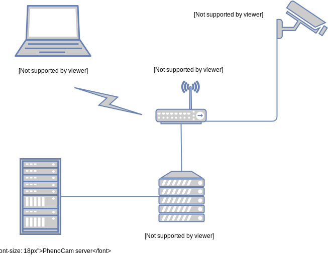

# PhenoCam Installation Tool (PIT)

PhenoCam Installation Tool (PIT) is a set of scripts for Linux/Mac OSX and Windows taking care of the settings as needed by cameras installed by or associated with the [PhenoCam network](http://phenocam.sr.unh.edu).

## Installation

### hardware prerequisites

Please connect a computer and the PhenoCam to the same (wireless) router which has internet access. Once your camera is powered on and connected to the network you will need to find your camera’s network IP address. Make sure that the computer you are using was able to connect to the network and got an IP via DHCP.



The easiest way to find the camera’s IP address is to install [StarDot Tools](http://www.stardot.com/downloads). Run the StarDot Tools program and click “refresh”. The camera should be detected and the camera’s IP address shown (you may have to run Tools as administrator in Windows, depending on your settings).

If you are configuring your camera with a non-Windows computer there are other things you can do to find the IP address of the camera. From a Linux or Mac OS X terminal window you should be able to type the following command:

```bash
arp -a
```

to get a list of the MAC addresses and IP’s of all the computers on the local network. The StarDot cameras have a MAC address that starts with 00:30 so you may be able to find the camera that way. Again, you may need help from the local network administrator for this step.

### software prerequisites

For the script to run successfully you will need a telnet client. As of Windows 7 telnet is not installed by default anymore but can still be downloaded from the Microsoft website. Full instructions can be found [here](http://technet.microsoft.com/en-us/library/cc771275%28v=ws.10%29.aspx).

Similarly, more recent versions of MacOS (formerly OSX) do not include the telnet client either. You will have to install the client by following these instructions:

```
1 - It is required that you have XCODE installed and configured
to be able to compile the packages. Access the terminal / shell

2 - Download the latest version of the inetutils package:
http://ftp.gnu.org/gnu/inetutils/

3 - Unpack with:
tar xvjf inetutils-1.9.4.tar.gz
  
4 - Enter the inetutils-1.9.4 folder with:
cd inetutils-1.9.4

5 - Configure the package with the following:
./configure --disable-servers --disable-dnsdomainname\
--disable-hostname --disable-ping --disable-ping6\
--disable-rcp --disable-rexec --disable-rlogin\
--disable-rsh --disable-logger --disable-talk\
--disable-tftp --disable-whois --disable-ifconfig\
--disable-traceroute

6 - To compile execute:
make

7 - Copy only the necessary files to /usr/local/bin/ , as below:
sudo cp telnet/telnet /usr/local/bin/
```

Alternatively you can install telnet using the [Homebrew](https://brew.sh/) framework using the following commands (skip the first if you have brew running).

```bash
# install brew (this might take a while 
# and sideload substantially more code than the approach above
/usr/bin/ruby -e "$(curl -fsSL https://raw.githubusercontent.com/Homebrew/install/master/install)"

# install telnet
brew install telnet
```

### PhenoCam network

clone the project to your home computer using the following command (with git installed)

```bash
git clone https://github.com/khufkens/phenocam-installation-tool.git
```

alternatively, download the project using download button.

Unzip the downloaded files or use the files cloned by git as is.

### ICOS network

clone the project to your home computer using the following command (with git installed)

```bash
git clone https://github.com/khufkens/phenocam-installation-tool.git -b icos
```

Alternatively, download the project using download button when on the ICOS branch page:

[https://github.com/khufkens/phenocam-installation-tool/tree/icos](https://github.com/khufkens/phenocam-installation-tool/tree/icos).

Unzip the downloaded files or use the files cloned by git as is.

### Third party network

When using a third party network you can change the SERVER, USER, and PASSWD parameters in the installation script (**phenocam_install.sh**, see files subdirectory in the repository), and repackage the file as shown below.

```bash
# clone the archive
git clone https://github.com/khufkens/phenocam-installation-tool.git

# enter the files subdir
cd phenocam-installation-tool/files/

# Edit the install file to include custom server, and ftp # login information.

# tar gzip the file on osx / ubuntu / windows 
tar czf phenocam_default_install.tar.gz *

# finally move the file to its final destination
mv phenocam_default_install.tar.gz /your/www/directory/
```
On a windows system use the [Ubuntu linux subsystem](https://docs.microsoft.com/en-us/windows/wsl/install-win10) to get access to the above command line tools.

Finally, edit either the PIT.bat or PIT.sh files to reflect the location of the new phenocam_default_install.tar.gz file. Note that the file should be served through a normal HTTP connection (not a HTTPS one).

Make sure you have a personal FTP server available with a **data** directory available from the FTP root. The camera will attempt to upload data to:

```
/data/your_camera_name_1
```

Create new subdirectories in **data** based on the cameras (names) you add to the network

## Use

The installation script runs within a terminal on all platforms. To open a terminal search for “Terminal” in OSX spotlight or “cmd” in the program search field (under the Start button) in Windows. For linux users I assume a familiarity with opening a terminal.

The installation **requires** you to have a working internet connection on the camera! Connect to the camera when it is hooked up to either an open network or a router / hub. If you do not have an internet connection on the camera the PIT tool will **not** work.

### Windows
On the command prompt of a terminal the scripts have the same syntax, for Windows script this would be:

```bash
PIT.bat IP USER PASSWORD CAMERA TIME_OFFSET TZ CRON_START CRON_END CRON_INT FTP_MODE
```

### Linux / OSX
On Linux / Mac OSX systems this would read:

```bash
sh PIT.sh IP USER PASSWORD CAMERA TIME_OFFSET TZ CRON_START CRON_END CRON_INT FTP_MODE
```

or

```bash
./PIT.sh IP USER PASSWORD CAMERA TIME_OFFSET TZ CRON_START CRON_END CRON_INT FTP_MODE
```

with:

Parameter     | Description
------------- | ------------------------------ 
IP	      | ip address of the camera 
USER	      | user name (admin - if not set) 
PASSWORD      | user password (on a new Stardot NetCam this is admin) 
CAMERA        | the name of the camera / site
TIME_OFFSET   | difference in hours from UTC of the timezone in which the camera resides (always use + or - signs to denote differences from UTC)
TZ            | a text string corresponding to the local time zone (e.g. EST)
CRON_START    | first hour of the scheduled image acquisitions (e.g. 4 in the morning)
CRON_END      | last hour of the scheduled image acquisitions (e.g. ten at night, so 22 in 24-h notation)
CRON_INT      | interval at which to take pictures (e.g. 15, every 15 minutes - default phenocam setting is 30)
FTP_MODE      | active or passive (default = passive)
[all parameters are required!]

An example of our in lab test camera configuration:

```bash
./PIT.sh 140.247.89.xx admin admin testcam3 -5 EST 4 22 30 passive
```

or

```bash	
./PIT.sh 140.247.89.xx admin admin testcam3 -5 EST 4 22 30 active
```
	
for an active FTP connection (necessary for some cameras)

This configures the camera 'testcam3', located in the EST time zone (UTC -5) to take images every half hour between 4 and 23h.

### Systems with short acquisition windows (on timers / limited power)

The PIT configures the cameras to randomly upload images within every time window. This reduces traffic on systems with multiple cameras and the server. However, on systems on timers with only a limited window for acquisition this random factor might cause the camera to not fire within the alloted time. To mediate this **manually edit** the system's crontab to correspond to the settings on your system. 

You can edit the crontab file by using the vi editor if you login to the home directory using telnet:

```bash
vi crontab
```
after editting the file make sure to save the settings by issueing the save command:

```bash
config save
```

Alternatively, edit the file through the advanced settings tab of the web interface of the camera. Hit the save button on the interface twice to guarantee that your settings will remain stored after reboot.

A crontab file is formated as such:
```bash
minute hour day month day-of-week command-line-to-execute
```

To set camera to run on the hour you would use the following line (minute zero of every hour from 4 - 22 inclusive):
```bash
0 4-22 * * * admin sh /etc/config/phenocam_upload.sh
```

There are several good cron references out there. [Here](https://linux.die.net/man/5/crontab) is one.


## Additional information and settings

The script will take care of any differences in model types, and will enable the upload of infrared (IR) images by default (if available). After the install be sure to check the results by browsing to the camera's IP address. You can see that the above commands have taken effect as the name and time zone offset are mentioned in the overlay on top of the image. If you are not sure about your time zone offset a visual time zone map can be found [here](http://www.timeanddate.com/time/map/).

Throughout the installation procedure the command prompt gives you feedback on the process. To test a succesful install it will try to upload a set of images to the PhenoCam server. If you request a site name beforehand (the data directory has to be created on the server), we can validate if the setup is pushing data correctly right after your install.

Critical in the operation is that you check and double check the input parameters (no true checks are in place). Although the script will never 'brick' a camera it can push settings which make the camera not behave properly and hard to reconfigure. In such a case the configuration of the camera can be reset to factory defaults by pushing the reset button on the back of the camera using a small rod. However, if access to the site is difficult you might want to make sure you push the right settings to the camera. Furthermore, as the configuration files are pulled from the PhenoCam server, internet access is vital to configure the camera correctly, if you have only intermitted internet access on your site make sure to run the install script during this time.

If a backup upload is required to a different server please edit the server.txt file. Here each line represents a server address. The server layout should adhere to the PhenoCam structure, where in the ftp root directory the data is stored in ~/data/your_camera_name directory. Write these changes on the camera from volatile to persistent (flash) memory using the following command:

```bash
config save
```
